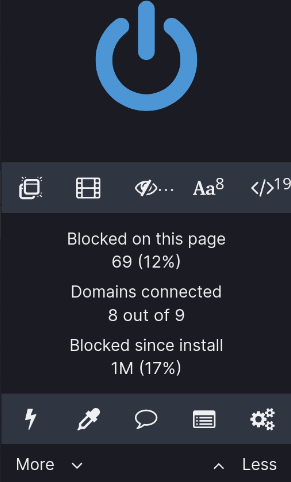

# uBlock Origin: 1 Million Blocked

<figure>
    
    <figcaption>
        Some random video sharing website with red logo
        volunteered to be the figure.
    </figcaption>
</figure>

It's only 5 months since the last fresh install of my NixOS, and [uBlock Origin](https://github.com/gorhill/uBlock) had already blocked 1 million requests. Although no way I'm willing to mess with those fancy data analysis toys, I'd still want to pull some words from my observation.

But first, some abbreviations used later need to be defined.

- **BR**: the count of blocked requests
- **BR%**: the `blocked/total` requests ratio

And here is the big list:

- The blocked 1 million requests are only about 20% of total
  requests. Nice :) our web still have some sorts of hope.

- The BR% of website from the first page of Google search result is about 10% on average, but it certainly depends on the topic being searched for.
  
  - Cooking/shopping/lifestyle websites are tremendously bloated. Most recipe sites have at least 20% BR%, and they also try to connect many, not less than 10 in general, third party domains for ads, embedded videos/slides or other things like Instagram share button.
  - News sites are equally bloated, not even most of them.
  - Amazon is absolutely horrible, at least 50% of total few **hundreds**
    requests got blocked on any page, including AWS etc. eBay is OK-ish comparing to Amazon, with about 20% BR%.

- People's blog despite the realm of their contents tend to have **zero** to very few BR. Although there are sites utilize Javascripts quite heavily.

- [Sourcehut](https://sourcehut.org/) is the winner among all other popular code hosting websites, with even no Javascript at all.

- European Google have fewer BR than American Google, with the cost of seeing consents on every blinking.

- European governments' websites don't have BR, while American ones are quite the opposite. (And non of the Asia governments don't have BR, I just checked.)

Shame that the number of blocked page elements(things removed by cosmetic filters) is not recorded, otherwise the count could already be rocket high.

That's all for now. If I can find more things interesting I'll add them to the list later.
