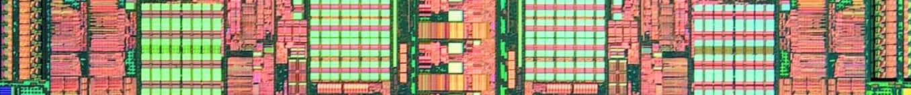

# Linux NOHZ_FULL and the surprising effect on CPU frequency scaling

For some background knowledge on Linux dynticks and NOHZ_FULL, checkout the wonderful [*CPU Isolation*](https://www.suse.com/c/cpu-isolation-introduction-part-1/)[^1] series articles from SUSE Labs.

 

The CPU my laptop equipped is a lovely [R7-4800HS](https://www.amd.com/en/products/apu/amd-ryzen-7-4800h) which has a base frequency of 2.9GHz and can boost up to around 4GHz while only draw few watts sitting idle, quite a nice CPU for laptops.

Someday I came upon the topic of dynticks and read some words on how NOHZ_FULL could help saving batteries and increase performance, I decided to yolo a try but later found the max frequency of *all cores* are capped at 2.9GHz :(

I silently panicked, then started debugging.

Is my motherboard busted? Is my laptop under-powered? Does my NixOS betray me? I run a custom built kernel but stocks kernel is all fine, so possibly have I disabled some important features?

Nope, none of the solutions I can think really hard of worked.

...Not until I typed `watch grep cpuinfo` and found *all cores except* the two housekeeping cores are capped at 2.9GHz. *Wheeeht a coincident*, is NOHZ_FULL not letting my CPU get correctly scaled? Several googling later it leaded me to this [LWN thread](https://lwn.net/Articles/816801/)[^2] which confirmed my theory. After reverted the configuration, I can do compile at full 4GHz speed[^3] again :)

NOHZ_FULL is best suited for huge boxes whose four 512-core CPUs are running at the maximum frequency with no scaling at all. But on a portable laptop, whether sacrificing a few GHz for *theoretically* more power efficiency, a tradeoff it is.

 
 

By the way, a quick note on how to active full dynticks.

- Kernel option `CONFIG_NO_HZ_FULL=y`

- Use `lstopo` provided by `hwloc` to find the topology of a CPU

    

  Here's the topology graph of my 4800HS with 8 cores and 16 hyperthreads, each hyperthread is a *core* from kernel's point of view. Notice that label starts from 0 instead of 1.

- Set kernel parameter `nohz_full` to desired CPUs, for example `nohz_full=2-15`.

  Cores *not included in* the list will *housekeep* timer interrupts for the rest cores who will be able to stay longer in deeper C-states uninterrupted, which in turn could reduce some energy consumption.

  The trick part is that *cores* on the same *physical core* need to be specified altogether, otherwise the *physical core* will still be powered preventing it from getting into deeper C-states.

- Expect cores spend more time in deeper C-states.

 
 

[^1]: Articles on [Web Archive](https://web.archive.org/web/20230613215054/https://www.suse.com/c/cpu-isolation-introduction-part-1/)

[^2]: Also [Web Archive](https://web.archive.org/web/20230625104128/https://lwn.net/Articles/816801/)

[^3]: Ehh, I mean my laptop, not...me myself.

