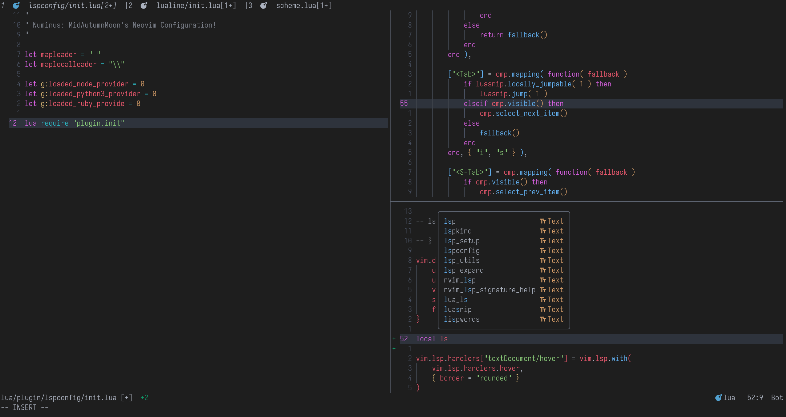

# Numinus

Special thanks to `junegunn`'s [dotfiles](https://github.com/junegunn/dotfiles/) for giving me a starter boost using Vim.

Dotfiles of people from which I borrowed useful ideas:

- https://github.com/lilydjwg/dotvim
- https://github.com/nicknisi/dotfiles/
- https://github.com/thecasualcoder/neovim-dotfiles/
- https://github.com/AndrewRadev/Vimfiles/
- https://github.com/lettertwo/config

|  |
| :-: |
| 2025 Feb Screenshot |
